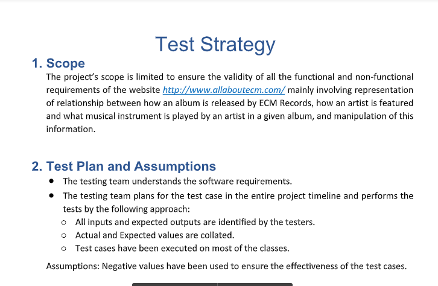

# System validation and verification and analysis
Developing reasonable constraints, or conditions for classes Album, Musician, and MusicianInstrument.
For exam- ple, the value of the attribute name in the Musician class should not be null and should contain at least two parts separated by a space (representing a first name and a last name). 
Similarly, the parameters for setter methods for non-null and non-empty attributes should guard against such values too.

